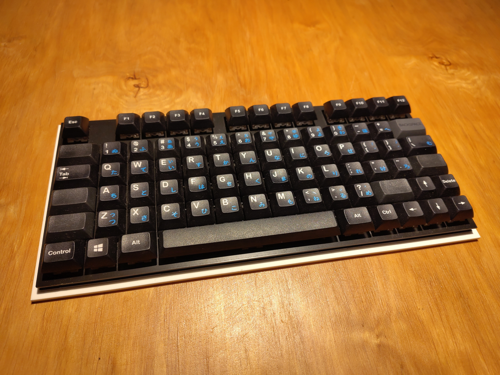

# Ingot keyboard

The Ingot keyboard is an ortholinear keyboard which can be configured as 100%, tenkeyless or 75% by breaking it apart.

## Features

- QMK firmware
- Cherry MX switches
- WS2812 RGB LEDs under each switch
- PCB plate for plate mounted switches
- Break apart to get a tenkeyless or 75% keyboard
- Separated numblock can be used on its own

## Todo

- Merge firmware into QMK project
- Use nRF 52840 module instead of ATmega 32U4
- Build a ZMK based firmware
- Add Bluetooth support and batteries
